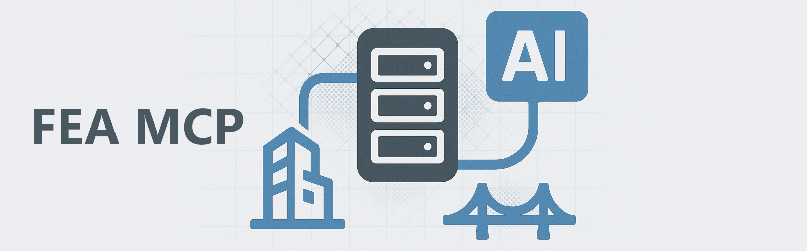

# FEA-MCP Server
An Finite Element Analysis Model Context Protocol Server for AI

## Overview

The FEA-MCP Server provides a unified API interface for interacting with various Finite Element Analysis (FEA) software packages. It enables AI control of FEA modelling, analysis, and post-processing through a consistent interface, regardless of the underlying software implementation (currently ETABS and LUSAS are supported).

## Features

Software Agnostic Interface: Connect to different FEA software packages using the same API
Geometry Creation: Generate points, lines, surfaces, and volumes programmatically

### Supported Functions

- **Multiple Software**: Supports mainstream FEA software including ETABS and LUSAS
- **Geometric Modelling**:
  - Create Point/Joint
  - Create Line/Frame/Beam/Column
  - Create Volume/Solid
  - Sweep Points/Lines/Surfaces (LUSAS only)
  - Get modelled Points/lines (LUSAS only)
  - Select objects (LUSAS only)
- **Other**:
  - Read model units

## Future Work
- Model Management: Define materials, sections, loads, and boundary conditions
- Analysis Control: Run simulations and retrieve results
- Coordinate System Support: Work with multiple coordinate systems

## Installation

### Requirements

Required python libraries:
```
pywin32>=228    # Windows COM interface support
comtypes>=1.4.0 # Windows COM interface support
mcp>=0.1.0      # Model Control Protocol library
```

System Requirements:
- Windows operating system
- Installed FEA software (ETABS, LUSAS)

### Guide
1. Install the required python libraries from command line:
```
pip install pywin32
pip install comtypes
pip install mcp
```
2. Download this repository and save the extracted files locally (e.g. at ```C:\your_path_to_the_extracted_server\FEA-MCP\```).
3. (Optional) Edit the MCP server configuration file, located at `src/config.json` (see configuration section). By default the server is set to use LUSAS v21.1.
4. Install Claude Desktop (or other AI client with MCP support).
5. Configure Claude Desktop to launch the MCP Server automatically (see Claude Desktop section).
6. You are good to go!

### Configuration

The configuration file is located at `src/config.json` and contains the following main settings:

```json
{
    "server": {
        "name": "FEA MCP",
        "version": "1.0.0"
    },
    "fea": {
        "software": "LUSAS",
        "version": "21.1"
    }
}
```

- **server**: Server name and version information
- **fea**: 
  - `software`: FEA software (ETABS, LUSAS)
  - `version`: software version (e.g. 21.1 for LUSAS)

### Claude Desktop

Open Claude Desktop > File > Settings > Developer > Edit Config, edit claude_desktop_config.json and add the following.
Caution: update the path and use double backslash!
Then restart Claude Desktop (from the tray icon, right click > Quit). 

```json
{
    "mcpServers": {
        "fea": {
            "command": "python",
            "args": [
                "C:\\your_path_to_the_extracted_server\\FEA-MCP\\src\\server.py"
            ]
        }
    }
}
```

### Service API

The server provides the following main API functions:

- `connectOnSoftware`: Connects on the selected FEA software
- `getSoftware`: Returns the selected FEA software name and version
- `getModelUnits`: Returns the model units
- `createPoint`: Creates a point/joint
- `createLine`: Creates a Line/Frame
- `createSurface`: Creates a Surface/Area

(the following are only available for LUSAS)
- `createPoints`: Creates multiple points
- `createLineByPoints`: Creates a line by points
- `createArcByPoints`: Creates an arc by points
- `createArcByCoordinates`: Creates an arc by coordinates
- `createSurfaceByLines`: Creates a surface by lines
- `sweepPoints`: Sweeps points to create lines
- `sweepLines`: Sweeps lines to create surfaces
- `sweepSurfaces`: Sweeps surfaces to create volumes
- `getPoints`: Get all modelled points
- `getLines`: Get all modelled lines
- `select`: Select modelled objects